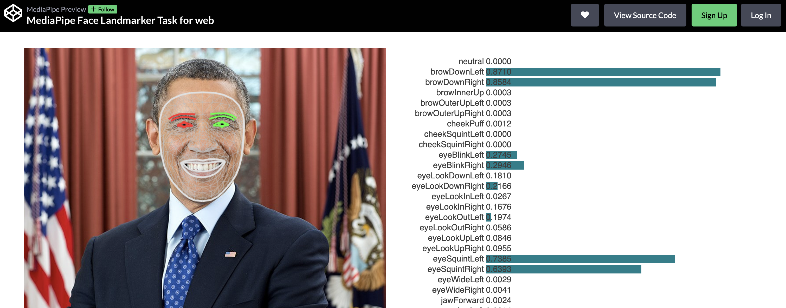

# Face
Today's class will start with a face demo. This is similar to the Hand Landmark demo, giving you visual position in real-time of multiple face landmarks and a “face mesh” which you could use in your code, for example, to identify all the parts of an image representing a face. This is a more complex example in many way, despite its ressemblance to the hand demo.

## Codepen Demo
There is a demo on [Codepen](https://codepen.io) that shows the basic functionality we will somewhat mimic in our starter sketch: [MediaPipe Face Landmarker Task for web](https://codepen.io/mediapipe-preview/full/OJBVQJm).

In this demo you will see the results of two things:
1. a real-time grouping of face landmarks into a series of [features](./Face/features.txt): eyes, eyebrows, lips, …
2. a series of “blendshapes” that allow you to estimate various degrees of multiple simultaneous face states: smiling, eyes closed, mouth open, etc

## Face Landmark Detection
Here is a link to the original Google [Face landmark detection guide](https://ai.google.dev/edge/mediapipe/solutions/vision/face_landmarker#configurations_options).

