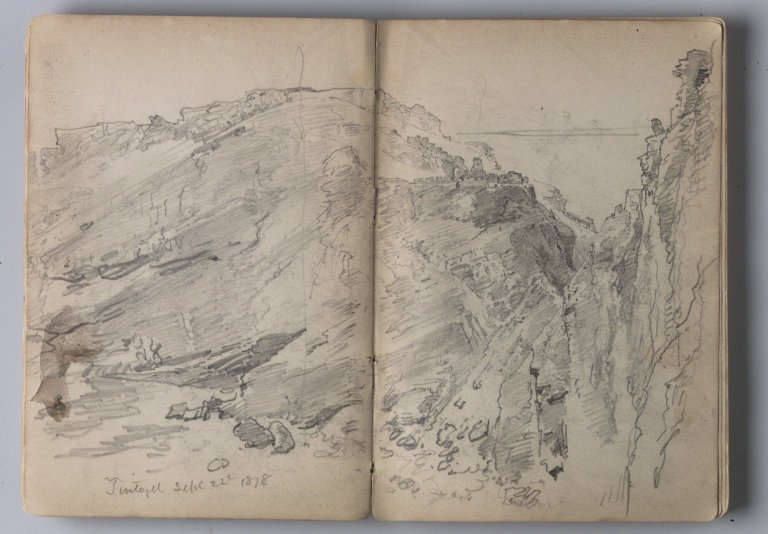
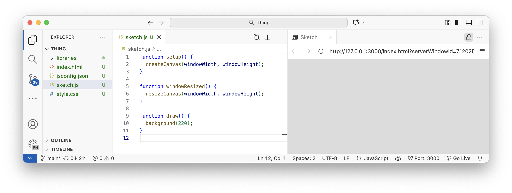
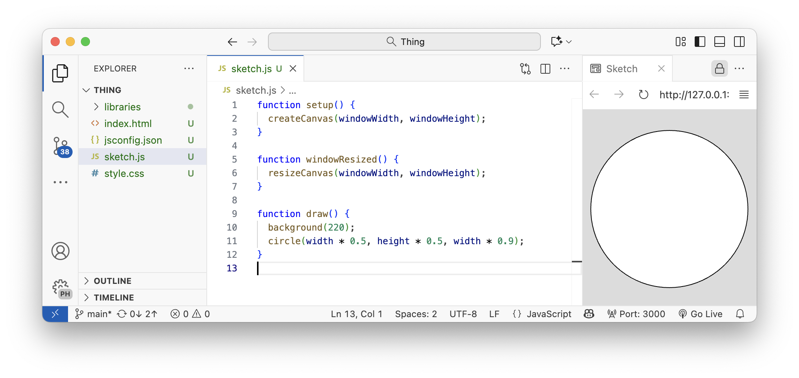
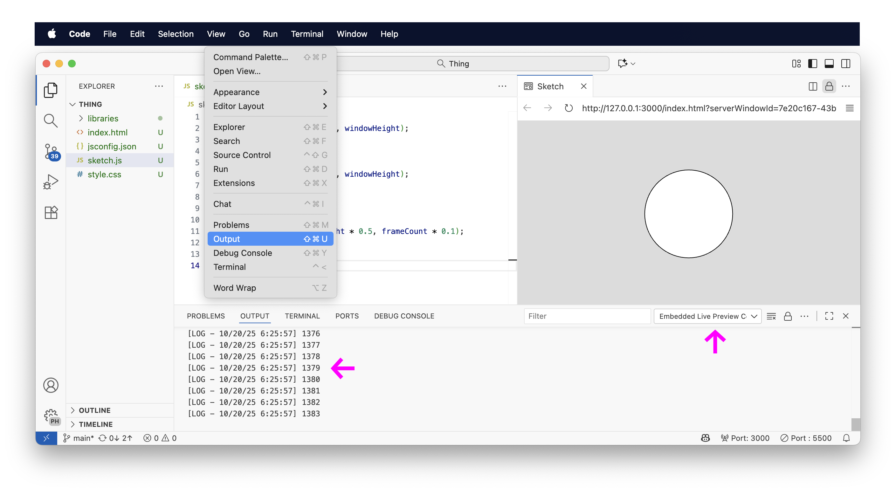
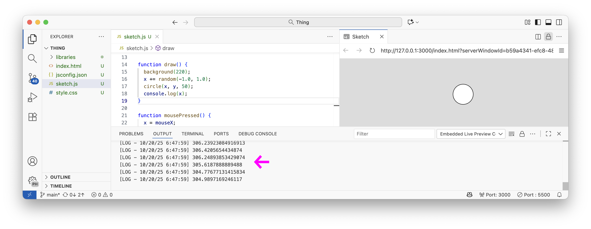
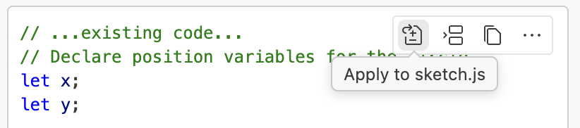
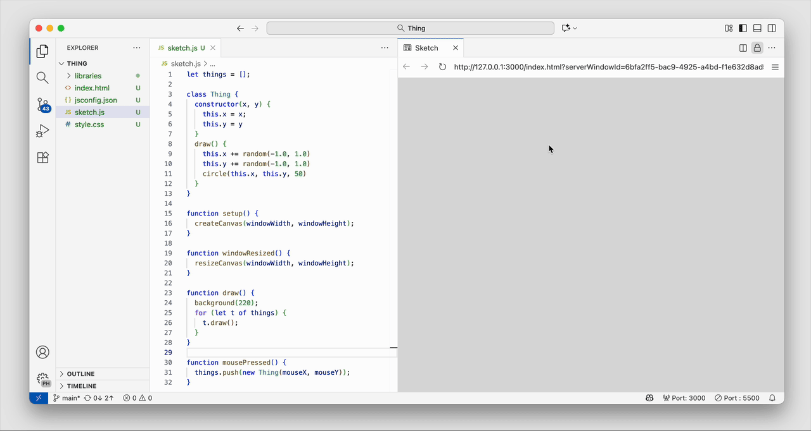

# Code Fundamentals
People will tell you that coding is hard. This might or might not be true, but I don't care.

Here's a crazy fast-ramp workflow that I have been teaching for years to get people started. It will take you from zero to sixty in almost no time from the raw basics, to the core fundamental of how most complex software works.

The idea of this lesson is to move from `varibles` to `classes` at record speed.

## Sketch
At the core philosophy of [P5.js]() is the concept of a `sketch`.

This term was created by [Casey Reas](https://reas.com), the co-creator of the [Processing](http://processing.org) language upon which P5 was created, and who began his studies not as an engineer, but as an art student, at the University of Cincinnati. Through his trained as a painter, Casey learned — as any art student knows — that you begin most work by exploring an idea through exploratory sketches. You do not start with a fully formed work of art; to the contrary, you start in the dark — the white page of a notebook — and little by little, line by line, you scratch stroke by stroke until the form appears.

This working method was the basis for exploring “sketches” through code: start with a raw canvas; little by little add shapes, color, movement.

[](https://en.wikipedia.org/wiki/Sketchbook)

## Empty Sketch
Let's start with a basic sketch. Every [P5.js](https://p5js.org) sketch has two “functions”: `setup()` and `draw()`.

```js
function setup() {
}

function draw() {
}
```

> Designer: Describe this sketch in the shortest possible way to an entry-level design student. Minimal wording, simple concepts, as short as possible. Only describe what is actually in the code.

> Copilot: A minimal p5.js sketch with empty setup() and draw() functions — no initialization or drawing code, so nothing appears.

In other words, our “sketch” doesn't do anything yet since its two functions are empty.

## Functions
Look at the two `function` above and note the weird syntax.

First observation: every `function` has a **name**, followed by parentheses `()`. It is the parentheses that allows the program to recognize it as a `function`. We will quickly learn that these parentheses can either be empty, or contain numbers and words.

Second observation: we define the **contents** or **actions** of a function using **braces**. Some people like to call them **mustaches**; there is even a programming language called [mustache](https://mustache.github.io) ;-}

## Basic Sketch
Let's put back the basic values of a P5.js into our two functions. Inside of the `{` and `}` we write everything that happens inside of what the robot called the “intitalization” phase of our program, and the “drawing“ phase of our program.

We will create a canvas by calling the `createCanvas()` function and give it a size by putting values directly inside of its parentheses. 

```js
function setup() {
  createCanvas(400, 400);
}

function draw() {
  background(220);
}
```

> Designer: Describe this sketch in the shortest possible way to an entry-level design student. Minimal wording, simple concepts, as short as possible. Only describe what is actually in the code.

> Copilot: Creates a 400×400 p5.js canvas and clears it each frame to a light gray background (no other drawing).

## Values
Note that [P5](https://p5js.org) uses raw numbers as its basic building blocks. Numbers are everywhere in P5; it is the raw currency that makes everything work.

Note however, that where you place the numbers, changes the meaning of how that number will be used by the program. According to the robot, when you write `createCanvas(400,400)`, the program translates this to mean the size of our canvas, i.e. *createCanvas(width-in-pixels, height-in-pixels)*. For a description of these values and their meaning, you will find a full explanation in the P5.js documentation under [createCanvas()](https://p5js.org/reference/p5/createCanvas/).

And also according to the robot, the third value — `background(220)` — translates to “clearing” the canvas with a background color of “light gray”. These color values range from `0` for black, `255` for white, and any value in between for the intensity of its shade of grey.

So we have an important lesson here: the placement of numbers allows the program to contextually know the *meaning* of the numbers and apply them accordingly.

### Variables
The amazing thing about a program is that it can be designed to *adapt* itself to changing situations. To do this, we need to replace the hard-coded values with magic, adaptive values, that can change the value itself to the `width` and `height` of our browser window whatever it may be. Let's ask the robot to make the change for us.

> Designer: Can you replace these hard coded values (400,400) with values that will adapt themselves to the entire width and height of the window?

> Copilot: I've updated sketch to fill the browser window and resize when the window changes:

```js
function setup() {
  createCanvas(windowWidth, windowHeight);
}

function windowResized() {
  resizeCanvas(windowWidth, windowHeight);
}

function draw() {
  background(220);
}
```

This sketch will now automatically change the canvas size to match, pixel-to-pixel, the current width and height of the window that contains it. Try changing your window size and note how the sketch perfectly adapts to it.



### Operations
Now that we have defined the `width` and `height` of our canvas, we can use them inside of our sketch to start drawing shapes. Here too we will place values in specific positions inside of a new function called `circle()` and that takes three values inside of its parentheses: *circle(horizontal position on x-axis, vertical position on y-axis, diameter in pixels)*.

Importantly, we will use the multiplication operator `*` so that our circle adapts itself perfectly to the center of our sketch, no matter what its dimensions.

> Designer: Let's place a 50-pixel-diameter circle at the middle of our sketch.

```js
function draw() {
  background(220);
  circle(width * 0.5, height * 0.5, 50);
}
```

There should now be a circle in the middle of our sketch, perectly adapted (50%, 50%) to the size of our canvas.

We can even make this circle adapt to the `width` or `height` of our sketch (you choice).

> Designer: Let's make the circle adapt its width to 90% of the width of the sketch.

```
function draw() {
  background(220);
  circle(width * 0.5, height * 0.5, width * 0.9);
}
```



### Change
So far, our sketch is static — a still image. But the true power of code lies in its ability to **change**.

In p5.js, the `draw()` function runs again and again — around 60 times per second. Think of it as the beating heart of your program. Every time it runs, it can change something: position, color, size, or any other value you imagine.

Let’s start with the simplest kind of change: **movement**.

```js
function setup() {
  createCanvas(windowWidth, windowHeight);
}

function windowResized() {
  resizeCanvas(windowWidth, windowHeight);
}

function draw() {
  background(220);
  circle(width * 0.5, height * 0.5, frameCount * 0.1);
}
```

> Designer: Explain to me what this sketch is doing in the shortest possible way.

> Copilot: A full-window p5.js canvas that clears to light gray each frame and draws a centered circle that slowly grows (diameter = frameCount * 0.1).

> Designer: Explain in more detail that last part: (diameter = frameCount * 0.1).

> Copilot:
> - frameCount is a p5.js variable that increases by 1 every frame (frames since the sketch started).
> - Multiplying it by 0.1 scales that count down to pixels: diameter = 0.1 * frameCount (pixels).
> - So the circle grows by 0.1 pixels each frame (e.g., at 60 fps ≈ 6 px/s, at 30 fps ≈ 3 px/s).
> - Examples: after 100 frames → 10 px; after 600 frames (~10s at 60fps) → 60 px.
> - It never resets, so the circle keeps getting larger and will eventually exceed the canvas unless you stop or constrain it.

### Console

> Designer: So the value of frameCount is a number that starts at 0 and increased once per frame. How can I see the value of frameCount?

```js
function draw() {
  background(220);
  circle(width * 0.5, height * 0.5, frameCount * 0.1);
  console.log(frameCount);
}
```

`console.log()` is a special function that allows us to peek inside of our code by printing out whatever value we place inside of the parentheses. To see this hidden message, open `View` → `Output` and select the `Embedded Live Preview` opention (cf. illustration):



Here, we can see that the value of `frameCount` is just a simple number that continues to count up. By multiplying its value by `0.1`, we slow down its progression.

### User-Defined Variables
We can also create our own variables. For example, these can be declared at the top of our code using the `let` keyword, followed by a name.

```js
let x;
let y;

function setup() {
  createCanvas(windowWidth, windowHeight);
  x = width * 0.5;
  y = height * 0.5;
}

function windowResized() {
  resizeCanvas(windowWidth, windowHeight);
}

function draw() {
  background(220);
  circle(x, y, 50);
}

function mousePressed() {
  x = mouseX;
  y = mouseY;
}
```

> Designer: How does this code work? Use as few words as possible to explain the fundamentals.

> Copilot: 
> - declare x,y
> - setup(): make full-window canvas; set x,y to center
> - windowResized(): resize canvas on window change
> - draw(): clear to light gray; draw 50px circle at (x,y) every frame
> - mousePressed(): move (x,y) to mouse position

Whenever the user clicks in the window, the `x` position of the mouse cursor or touch location is used to define our `x` variable, which is then used 60 times per second to define our circle. The same variable redefinition is also used for the `y` position.

### Random
Let's add a little wiggle movement so we can better see how all this can be animated.

Here is solely the modified part of our `draw()` function from above:

```js
function draw() {
  background(220);
  x += random(-1.0, 1.0);
  circle(x, y, 50);
  console.log(x);
}
```

Note how 60 times per second, the `random()` function chooses a random value between `-1.0` and `1.0` and adds it to our `x` position. If we want to see that change, we can print in out in the `console`.



Note how the values can change microscopically.

### // Comments
Our code has suddenly gotten complex. We should add some notes inside of it to keep track of what's happening. But since we're lazy, let's let the robot do this work for us. *“Robot, do thing.”*

> Designer: Can you add some comments in my code so that I can better read it?

```js
// Declare position variables for the circle
let x;
let y;

function setup() {
  // Create a canvas that fills the browser window
  createCanvas(windowWidth, windowHeight);
  // Start circle in canvas center
  x = width * 0.5;
  y = height * 0.5;
}

function windowResized() {
  // Resize canvas when the browser window changes
  resizeCanvas(windowWidth, windowHeight);
}

function draw() {
  // Clear background to light gray each frame
  background(220);
  // Move circle randomly left/right each frame
  x += random(-1.0, 1.0);
  // Draw circle at (x,y) with 50px diameter
  circle(x, y, 50);
  // Print out current x value to console
  console.log(x);
}

function mousePressed() {
  // Move circle to mouse position when clicked
  x = mouseX;
  y = mouseY;
}
```

As you can see, the robot has added helpful comments that are color-coded so that you can distinguish it from the functioning code in your program.

### Apply



If you see the `Apply to ______` button (cf. illustration), Copilot can even change your code for you automatically. This is a very powerful workflow that opens up non-programmers to the magical world of vibe-coding, where the talk to a robot, push a magic button, and see the robot apply all the changes you want for you.

While the goal of this workshop is to use the flow your conversation to guide your robot step-by-step, at some point you will inevitably start pushing this button quite a bit. This is fine, as long as you keep in mind the overall pedagogical goal of understanding step-by-step what your robot is doing, and keeping your code to an elegant level of economy and readability.

## Class
Ok, let's go crazy. One wiggly interactive circle is cool, but what if we could have a whole screen full of them. Yeah, that would be super cool. So how do we do that?

There is a special concept in programming, usually reserved for an elite *class* of fancy people who “know how to code”. Hence the royalist mindset in our terminology. Now, you might or might not fall into this camp already, or will do so in the future — but there is also this thing called robot-assisted vibe-coding, or code completion, or whatchamacallit, so why don't we just ask the robot to “do thing” and convert our wiggly circle into an entire “class” of wiggly circles so that they can all wiggle all over the screen.

> Designer: Can you take all of the variables and circle drawing behavior and place it into its own class? Let's call this class Thing. We don't want to call it circle because that already exists in P5.

> Let's not create any new things onscreen yet. We'll just start with an empty list of things, each of which will be a future potential thing.

> Then when the user clicks on the mouse, we will create a new Thing inside this list of things.

> Please keep the code as short as possible

```js
let things = [];

class Thing {
  constructor(x, y) {
    this.x = x;
    this.y = y
  }
  draw() {
    this.x += random(-1.0, 1.0)
    this.y += random(-1.0, 1.0)
    circle(this.x, this.y, 50)
  }
}

function setup() {
  createCanvas(windowWidth, windowHeight);
}

function windowResized() {
  resizeCanvas(windowWidth, windowHeight);
}

function draw() {
  background(220);
  for (let t of things) {
    t.draw();
  }
}

function mousePressed() {
  things.push(new Thing(mouseX, mouseY));
}
```

Wow! Look at that. A whole window of wiggly `things` wiggling all over the place.



## Analysis
Let's break down how all this code works, starting with the `class` declaration:

### Classes
A **class** is a recipe for making many similar objects.  
In our sketch, `Thing` describes what each dot *is* (its data) and what it *does* (its behavior).

```js
class Thing {
  constructor(x, y) {   // runs once when we create it
    this.x = x;         // each Thing remembers its own x, y
    this.y = y;
  }
  draw() {              // runs every frame (when we call it)
    this.x += random(-1, 1);
    this.y += random(-1, 1);
    circle(this.x, this.y, 50);
  }
}
```

> Copilot:
> - constructor(...): sets up the new object’s starting values.
> - this: means “this particular Thing” (not any other).
> - Methods (like draw) are actions the object can perform.
> Mental model: A cookie cutter (class) that can make many cookies (objects), each with its own position.

### List

A list (JavaScript calls it an array) stores many Things together so we can manage them as a group.

```js
let things = [];                               // start with an empty list
things.push(new Thing(width/2, height/2));     // add one Thing
```

> Copilot:
> - `[]` creates an empty list.
> - `.push(item)` adds a new item to the end.
> -	Each click we do: `things.push(new Thing(mouseX, mouseY));`

### Loop

To update/draw all Things every frame, we loop over the list using the `for…of` syntax:

```js
function draw() {
  background(220);
  for (let t of things) {   // read as: “for each Thing t in things…”
    t.draw();               // ask that Thing to do its own drawing
  }
}
```

> Copilot:
> - for (let t of things) visits each item in order.
> - Inside the loop, t is a single Thing, so we call its method: t.draw().
> Why this pattern works so well
> - Separation of concerns: the Thing knows how to draw itself; the sketch just asks each one to do so.
> - Scales naturally: 1 or 1,000 Things — the code is the same.
> - Composability: later, each Thing can get its own size, color, velocity, etc., without changing the loop.

### Summary
- Class = blueprint
- List = many objects
- Loop = do something to each thing one-by-one

> Designer: Can you create a full commented version of this code?

```js
// ============================================================
//  Wiggle Things
//  A full-screen interactive sketch that creates
//  many small "Thing" objects that move randomly.
//
//  Demonstrates: classes, arrays (lists), and for...of loops
// ============================================================

// 1. Start with an empty list (array) to store all our Things
let things = [];

// 2. Define a "class" — a reusable blueprint for all Things
class Thing {

  // The constructor runs once when we create a new Thing
  constructor(x, y) {
    this.x = x;       // remember this Thing's x position
    this.y = y;       // remember this Thing's y position
  }

  // The draw() method describes what this Thing does each frame
  draw() {
    // random motion (small wiggle)
    this.x += random(-1, 1);
    this.y += random(-1, 1);

    // draw a circle representing this Thing
    circle(this.x, this.y, 50);
  }
}

// 3. setup() runs once at the beginning
function setup() {
  createCanvas(windowWidth, windowHeight); // full-window canvas
  noStroke();                              // remove outlines
  fill(0);                                 // black fill for circles
}

// 4. draw() runs about 60 times per second
function draw() {
  background(220); // light gray background (clears canvas each frame)

  // loop through all the Things in our list
  for (let t of things) {
    t.draw();      // tell each Thing to update and draw itself
  }
}

// 5. When the user clicks, add a new Thing to the list
function mousePressed() {
  // create a new Thing at the mouse position and add it to the list
  things.push(new Thing(mouseX, mouseY));
}

// 6. Resize the canvas if the window changes size
function windowResized() {
  resizeCanvas(windowWidth, windowHeight);
}
```