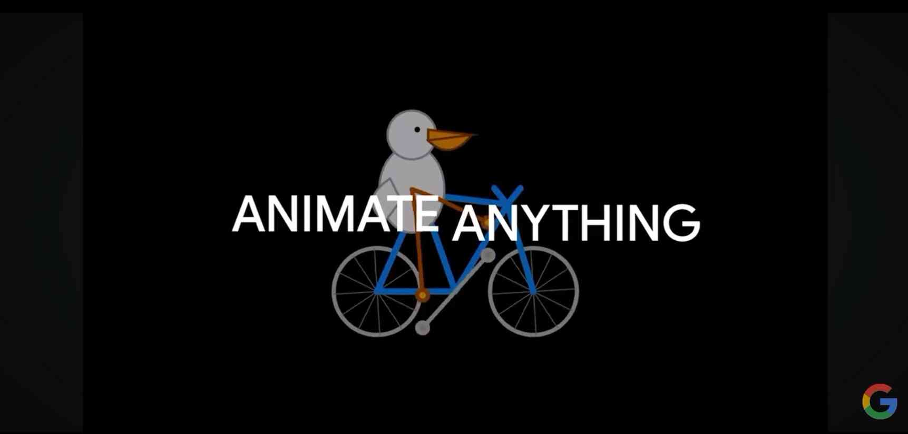

# Hello Robot
It used to be a fantasy that one day we would be able to talk to robots in our own “natural language” — i.e. using imperfect, ambiguous, inaccurate human idioms — and the robots would do the hard part and translate our commands into the technical jargon that *just makes it #@§%$ work*. This used to be fantasy. Today it is — almost — our new reality. We are moving closer to a world where we can say:

> Hey Robot, do thing.

And from the given context the robot will figure out what we mean by “thing”, and *just do it*.

Almost.

In other words… we’ll see…

So as this future shakes itself out, here are some **tips on how to talk to your AI large language model coding assistant**.

## Large Language Models
Cf. presentation `grammar-attention-context.pdf` in Switch Drive.

## Pelicans on Bicycles
One important catch to our current predicament: we are not merely asking a robot to help us write code.  
We are asking a robot to help us write *elegantly designed æsthetic experiences* that go beyond mere functionality.  
The problem is not only to get the robot to “do thing”, but to *do thing in a compelling and elegant manner*.

I.e. our problem is two-fold:
- Robots do not currently understand very well — although they are getting better — how to move from textual language to drawing processes
- Robots are statistically encoded with a rich dataset on the history of visual design and the arts

In his talk about [Pelicans on Bicycles](https://youtu.be/YpY83-kA7Bo?si=DeGIYSxi6SkmgYAu), the AI engineer Simon Willison illustrates for example the difficulty of getting a robot to draw a purposefully ambiguous illustration.

[](https://www.youtube.com/watch?v=YpY83-kA7Bo)

## Context Engineering
Many people understand now the concept of “prompt engineering”.  
But when working with code, it’s often more helpful to think in terms of **context engineering** — what information you give the robot, how clearly you describe your intent, and how you structure the surrounding material. This is what we mean by “semantic territory”: your job is to place the robot in the sematic territory closest to the type of coding you want it to help you generate.

### Give it a starting point
Don’t just say “make a drawing program.” This is too general. Avoid anything general: its attentional proximity will just connect up with too many other vague general concepts.
Instead:  
> Create a simple p5.js sketch that lets me draw with the mouse using circles that fade slowly over time.

### Describe the goal, not the steps
Tell it *what* you want, not *how* to do it. Let the robot make the first move — then edit or refine.

### Iterate
Work back-and-forth in a conversational manner. If you don't like the robot’s proposal, say so, and why. Guide it into the context you are more interested in.

## Process
Ask the robot to explain your own code to you, its process — i.e. how it works —, what the terms mean inside your sketch. Embody different personas to describe the level of explanation you would like:

> explain it to me as if I were a high-school student

> explain this code to me as if I were a 10-year old

> explain this program to me as if I were an impressionist painter

### Empty Sketch

1. Create a new P5.js sketch
2. Call the sketch `Empty`
3. Replace the boiler-plate code with this empty code:
```
function setup() {
}

function draw() {
}
```
4. Click on the `+` button in the `Copilot Chat Window` to start an enitrely new chat.
5. Ask your bot to explain your code to you, inventing different types of knowledge levels. Be diverse: see how it would explain to different types of people.

> Explain this program to me as if I were a 50-year old impressionist painter discovering creative coding for the first time.

6. Don't leave the conversation at the first reply. Give additional feedback, context. Guide the discussion.

## Conversation Tips

1. **Be polite, but clear.**  
   Tone doesn’t matter to the model, but clarity does.  
   “Please” is optional; “be more minimal” is powerful.

2. **Work iteratively.**  
   Small, frequent prompts lead to better results than one big vague question.  
   Think of it like pair programming — talk while you code.

3. **Show, don’t tell.**  
   If Copilot gets it wrong, correct the code yourself, then say:  
   > No, like this — now make it respond to hand motion.  
   It learns from your corrections in context.

4. **Ask for simplifications.**  
   Robots love overcomplicating things. Say:  
   > Make this shorter and easier to read.  
   or  
   > Rewrite this with fewer variables.

5. **Name your intentions.**  
   Be explicit about your design goals:  
   > I’m trying to demonstrate motion tracking, not realism.  
   > Keep the code minimal so it’s easy to follow.

## When It Gets Weird

1. **If Copilot freezes or repeats itself:**  
   - Type `Cmd + I` / `Ctrl + I` to reopen the chat.  
   - Ask:  
     > Why did you repeat that? Show me a different approach.

2. **If it refuses to help:**  
   - Simplify your question.  
   - Or ask:  
     > I just need example code, not a full application.

3. **If it makes things worse:**  
   Undo (`Cmd + Z`) and move on.

Remember: you’re not “programming” anymore — you’re *negotiating with a machine intelligence.*  
Be patient, be playful, and always keep one eye on the mystery of what it’s trying to say back.