# Code
This is a collection of code created during the week of October 20 to 24, 2025 for the Oracle of Suits project, in collaboration with the [Swiss Museum of Games](https://museedujeu.ch).

## Physical Computing workshop
There is a series of tutorials on [Physical Computing](./tutorials/readme.md) that explains how to set up your coding environment, which tools to install, how to collaborate with coding assistants during your experimentation and development process.

## Dailies
We organize our coding sessions into “daily” folders in order to stay punk and experiment with whatever but also keep the messy chaos in check. A daily folder can contain whatever, or not much, depending on state of spleen.

- [2025-10-20](./2025-10-20/)
- [2025-10-21](./2025-10-21/)
- [2025-10-22](./2025-10-22/)
- [2025-10-23](./2025-10-23/)

## Hand Landmark Demo
There is a [Hand Landmarks demo](./2025-10-22/Hands/) demo showing how to use the [Google Media Pipe API](https://ai.google.dev/edge/mediapipe/solutions/guide) with [P5.js](https://p5js.org) to detect hands.

## Face Landmark + Blendshape Predition Demo
There is a [Face Landmarks + Blendshape demo](./2025-10-23/Face/) demo show how to use the [Google Media Pipe API](https://ai.google.dev/edge/mediapipe/solutions/guide) with [P5.js](https://p5js.org) to detect faces.

## Videos
Here are some screenshots of videos the students recorded of their experiments.

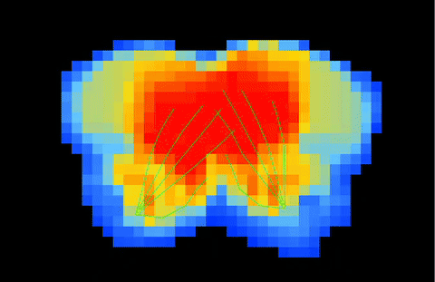 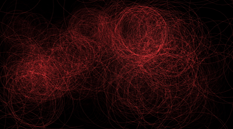 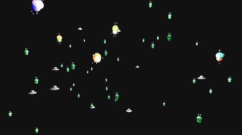 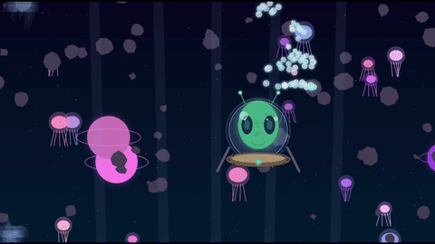 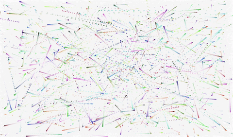 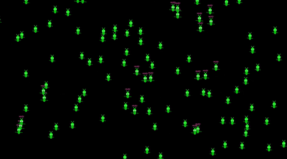 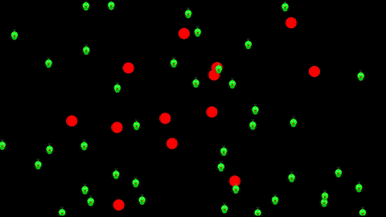 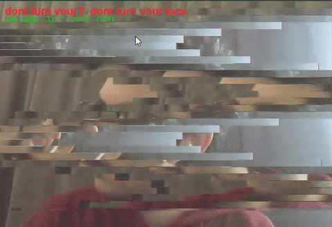 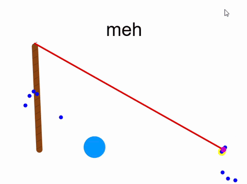 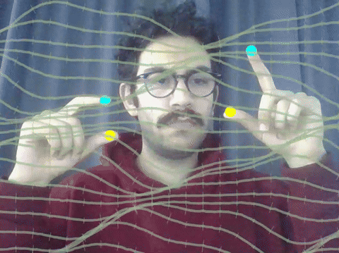 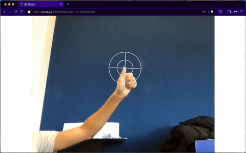 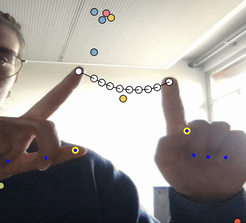 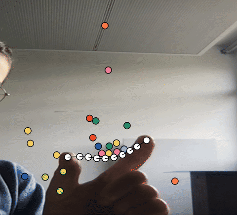 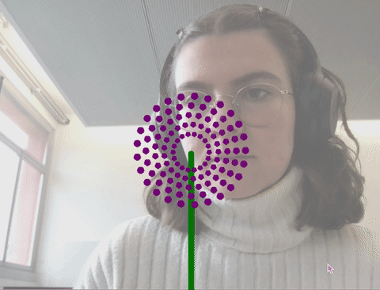 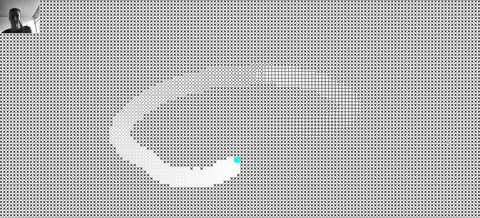  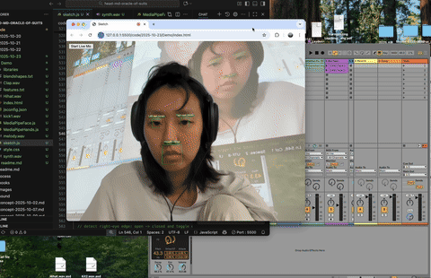 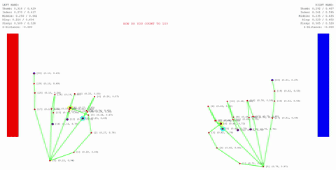 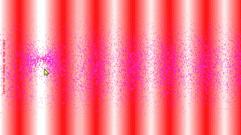 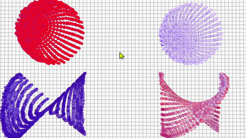 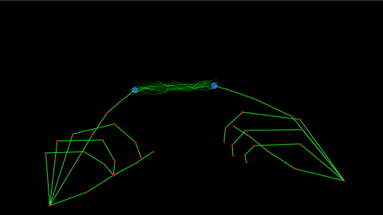 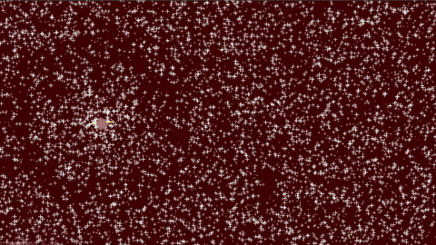 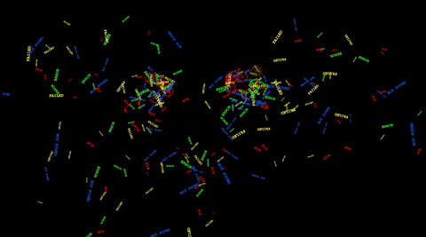   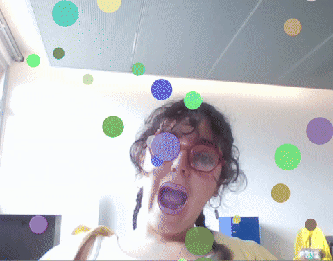 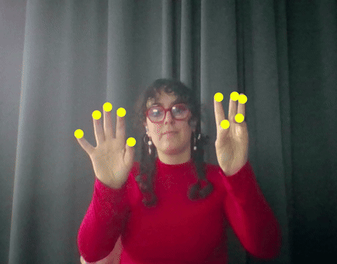 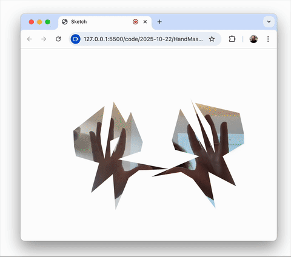   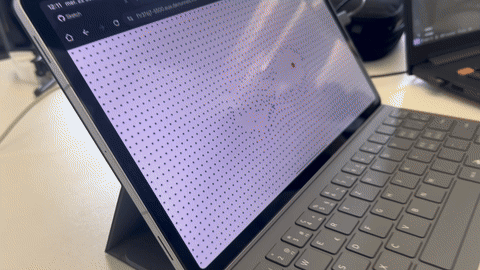 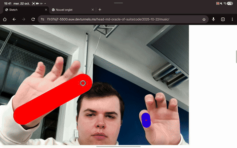 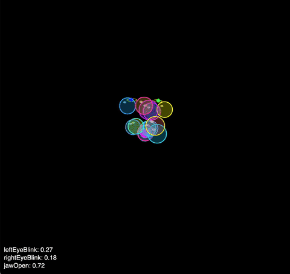 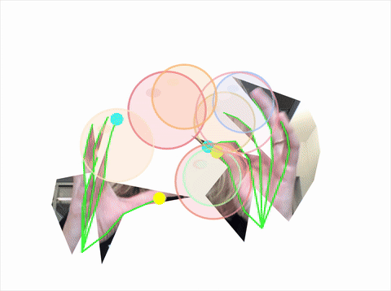 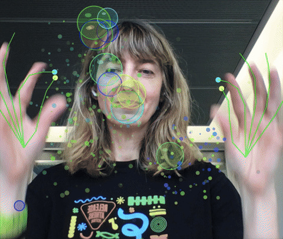 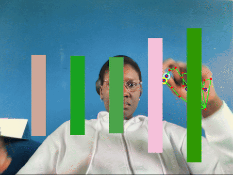 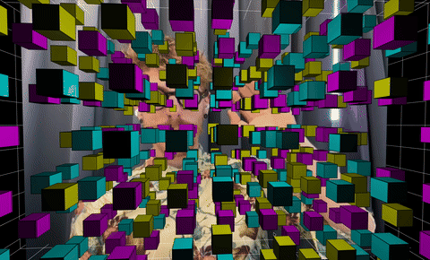 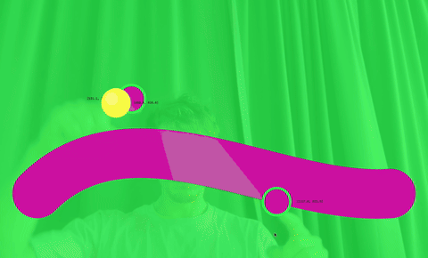 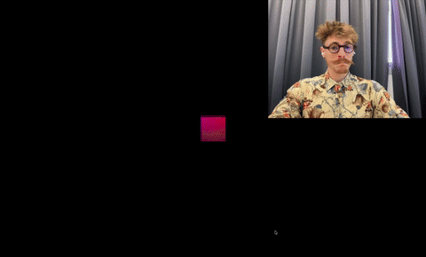 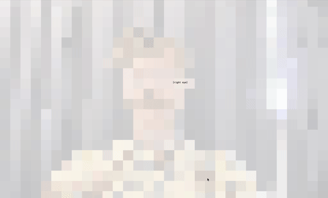 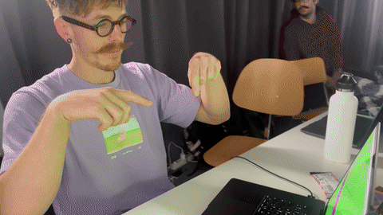 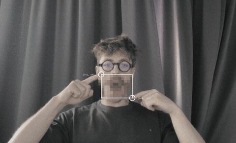 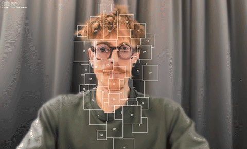 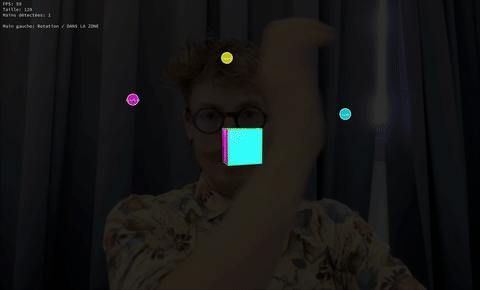 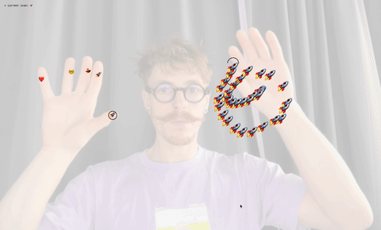 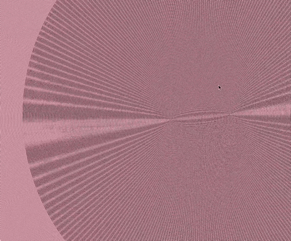 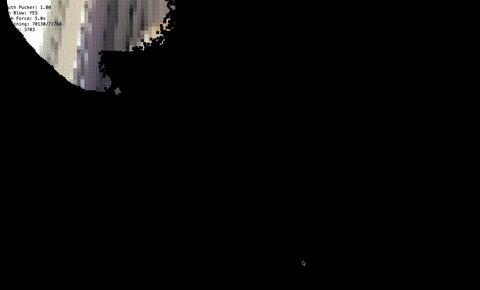 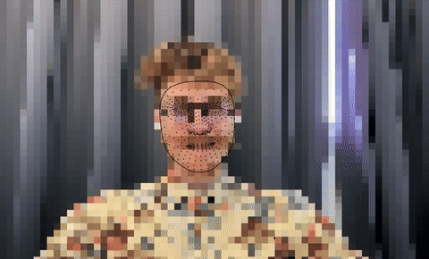 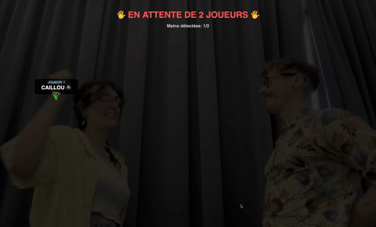 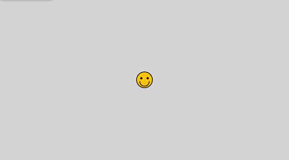   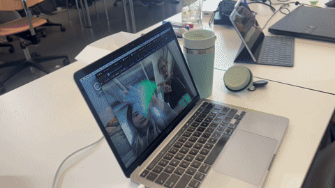 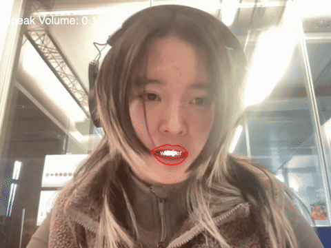 

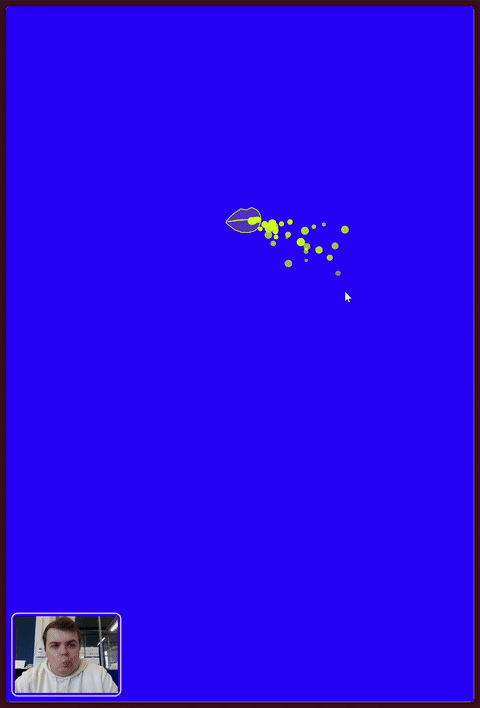 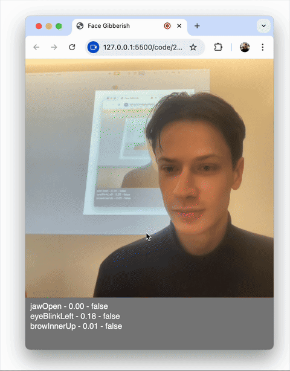 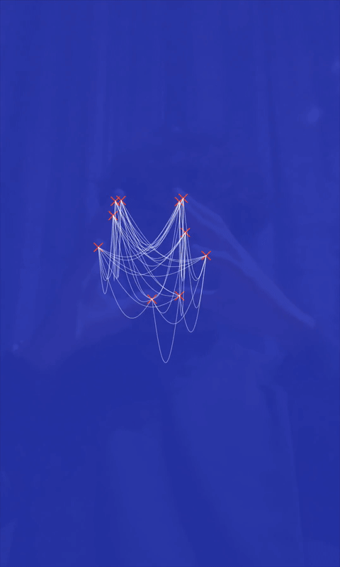    