# Setup
Let's get your development environment setup.

## P5 Editor
One of the fastest ways to get up and running in any context is to use the [P5.js online Editor](http://editor.p5js.org/egazzarr/sketches/TYmuqT4Tf).

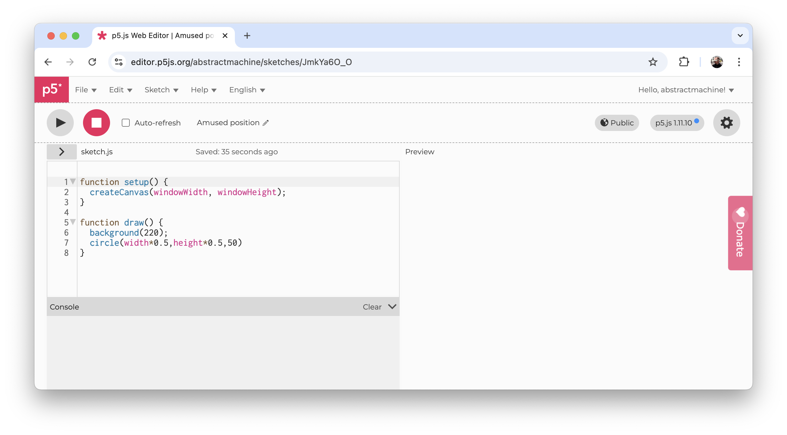

For this workshop, however, we will principally be using VS Code + Codepilot.

## VS Code
1. Download & install [Visual Studio Code](https://code.visualstudio.com/)
2. Open it once to allow it to finish setup

### Profile
Let's start with a clean “profile” in VS Code. This allows us to keep our different projects’ tools better organized without conflicting installations.

1. `Menu` → `Code` → `Settings` → `Profile` → `Profiles` → `New Profile` → `Name` : `PhysicalComputing`
2. Choose your preferred color theme: `Menu` → `Settings` → `Theme` → `Color Theme`

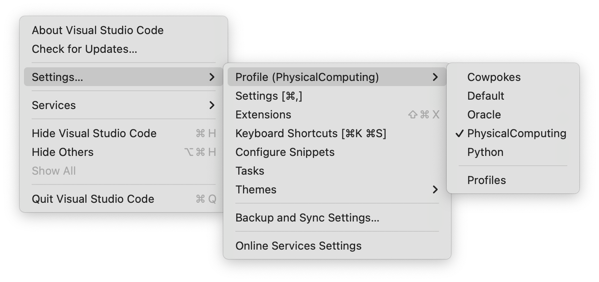

### Extensions
Open the `Extensions` tab in the `Side Bar` of VS Code.


Install the following extensions:

1. Install Microsoft's [Live Server](https://marketplace.visualstudio.com/items?itemName=ritwickdey.LiveServer) for opening your sketches in a browser
2. Install Microsoft’s [Live Preview](https://marketplace.visualstudio.com/items?itemName=ms-vscode.live-server) for diplaying your sketching directly inside VS Code
3. Install [p5.vscode](https://marketplace.visualstudio.com/items?itemName=samplavigne.p5-vscode) which will help you create new P5 sketches quickly
4. Verify that [Github Copilot](https://code.visualstudio.com/docs/copilot/overview) and [Github Copilot Chat](https://marketplace.visualstudio.com/items?itemName=GitHub.copilot-chat) are installed in your `Extensions` tab.

### Working folder
The core anchor of any VS Code session is the working folder. In almost all instances this means a folder located somewhere on your compter. We will start with your current `head-md-oracle-of-suits` git repository.

1. In either `Explorer` or `Menu` → `File` → `Open Folder` choose your root folder you will be working from
2. Choose your current `head-md-oracle-of-suits`folder on your computer
3. Create a `code` folder inside of this folder
4. Create a `readme.md` file with a short & simple description of this folder's goals: *This folder contains...*
5. Test your `readme.md` file with a right-click → `Open Preview`

### Commit
For this workshop we will be sharing code with each other through our [github.com](http://github.com) public repositories. Commit your changes by opening the `Source Control` icon.


1. Add all your latest changes
2. Commit changes with a simple message
3. Sync your changes with your online github repository.

We will verify that everyone is able to sync their local changes to their online repository before moving on. If you have already succesfully reached this step, please help your fellow students.

### Dailies
We are going to be working on various daily experiments. Let's use our inverted-date format:

1. Inside your new `code` folder, create a folder with today's date: `2025-10-19`. We place all of today's “sketches” inside of this folder.

## P5.js
For this workshop we will be using [P5.js](https://p5js.org), a core development library created by and for artists, designers, and creatives of all sorts wishing to explore the world of “creative coding”. [P5.js](https://p5js.org) is the web-based, JavaScript variant of the older [Processing](https://processing.org) platform based on the Java programming language.

### First Sketch
Let's create our first sketch inside our daily code folder, using [Sam Levine's P5.js Extension](https://marketplace.visualstudio.com/items?itemName=samplavigne.p5-vscode) you previously installed:

1. Press `Cmd + Shift + P` (Mac) or `Ctrl + Shift + P` (Windows/Linux) to open the **Command Palette**, or select `Menu` → `View` → `Command Palette`
2. Start typing `p5` and you should see a menu item **“p5: Create new p5.js project”** that you can select and press Enter
3. This should open your computer's file browser where you can select the new folder you just made (`2025-10-20/`)
4. Inside of the file browser, create a new folder named `Hello` and `Open` it
5. If you see an alert, reassure your computer that you are okay to `Always` allow `VS Code` to make changes to this folder
6. You should see a new window with your new sketch folder named `Hello` in the `Explorer` with the following files:
    - `libraries`
    - `index.html`
    - `jsconfig.json`
    - `sketch.js`
    - `style.css`

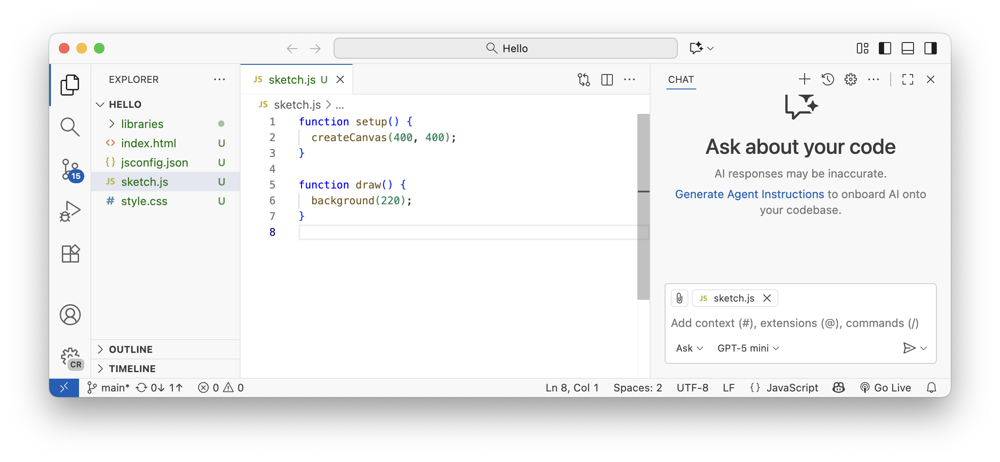

### Preview
If you installed the [Live Preview](https://marketplace.visualstudio.com/items?itemName=ms-vscode.live-server) extension correctly, you should now be able to right-click on the new `index.html` file and select `Show Preview`.

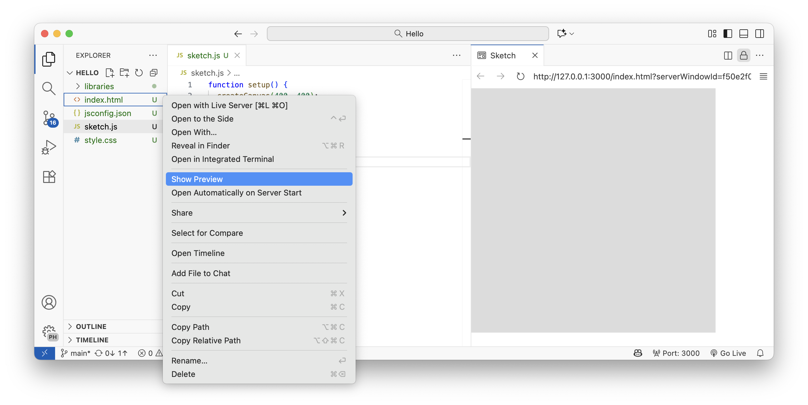

This should open a little mini preview browser inside of your VS Code environment with your P5.js sketch running live. As you change the code + save these changes (`cmd` + `s`), you should see the results change in this preview window. This is the fastest way to work in VS Code with P5.js, and mimicks the [Live Coding](https://en.wikipedia.org/wiki/Live_coding) style of creative development (cf. [Livecoding melodic DNB music in Strudel](https://youtu.be/aPsq5nqvhxg?si=3dvMknaQJZ8PzZ4A)).

### Live Server
Preview is good for quickly iterating with your code, but we also want a method for full-screen execution of our code. We will do this by opening our code in a browser — preferably [Google Chrome](https://www.google.com/chrome/) — using the [Live Server](https://marketplace.visualstudio.com/items?itemName=ritwickdey.LiveServer) extension we installed earlier.

So that we can fully appreciate our “sketch“ in a fullscreen window, let's change the code in our `Hello` project's `sketch.js` file to the following:

```
function setup() {
  createCanvas(windowWidth, windowHeight);
}

function draw() {
  line(pmouseX, pmouseY, mouseX, mouseY);
}
```

1. **Save your current sketch.**  
   Always make sure your work is saved before launching the Live Server — otherwise it won’t show your latest edits.

2. **Default Browser: Chrome**
    - From the `Extensions` tab, select `Live Server` `Settings` gear icon
    - From the dropdown, choose **`chrome`** (on macOS you might need **`google chrome`**).

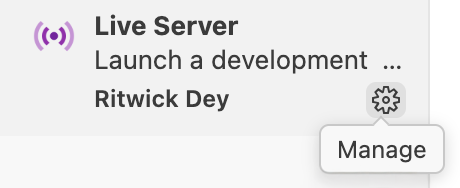

3. **Launch Live Server.**  
   - Look for the **“Go Live”** button in the bottom-right corner of the VS Code window
   - Click it once to start the Live Server
   - Your sketch should automatically open in **Google Chrome**

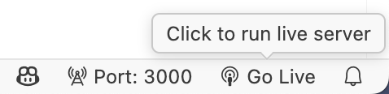

   - Optionally, you can right-click on the `index.html` file and choose `Live Server`

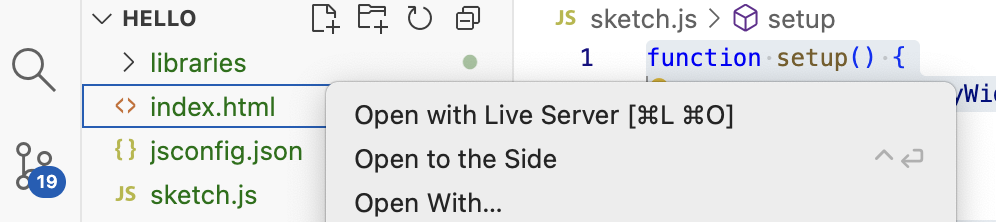

4. **Go Fullscreen.**  
    - Once Chrome is open, click the **green fullscreen button** in the top-left corner (macOS), or press:  
        - **Mac:** `Ctrl + Cmd + F`  or `🌐 + F`
        - **Windows/Linux:** `F11`
    - Your sketch should now fill the entire screen, showing your P5 canvas edge to edge.

5. **Hide the Chrome toolbar (optional but recommended).**  
    - In Chrome’s top menu, select:  
        `Menu → View → Always Show Toolbar in Full Screen`

6. **Exit fullscreen.**  
    - Press `Esc`, or repeat the same keyboard shortcut you used to enter fullscreen.

You now have two complementary ways to work:

- **Live Preview** inside VS Code — for fast iterative development.  
- **Live Server** in Chrome — for full-scale display and interaction testing.

## Copilot
We are going to use the `Copilot` robot to help us throughout our creative coding experiments.

### Account
Before we start, make sure you have already activated your free [Copilot Educational Account](https://docs.github.com/en/copilot/how-tos/manage-your-account/get-free-access-to-copilot-pro). All students already tested their [GitHub Copilot student accounts]() last week, so this setup part should be quick.

1. **Verify the extensions.**  
   In the **Extensions** tab, confirm that both are installed and enabled:  
   - `GitHub Copilot`  
   - `GitHub Copilot Chat`

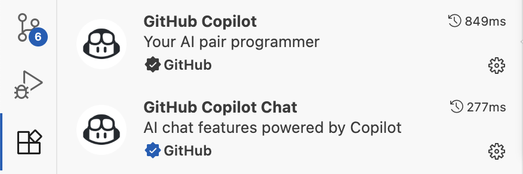

2. **Sign in if prompted.**  
   If you see a banner asking to sign in, click **“Sign in with GitHub”** and authorize VS Code

3. **Check the Copilot status icon.**  
   Look in the bottom-right corner of VS Code for the **Copilot logo**  
   - If it’s lit → Copilot is active
   - If it’s gray → click it once to re-enable


4. **Open and close the Copilot Chat panel.**
   - Click the **Copilot Chat** icon in the sidebar (speech bubble)
   - Or toggle it with: **Mac:** `Cmd + I` · **Windows/Linux:** `Ctrl + I`

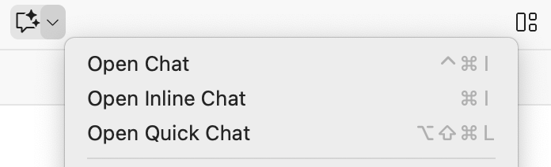

5. **Ask Mode**  
   In the Copilot Chat panel, open the **mode selector** (usually next to the input or in the chat header) and choose **Ask**.
   This keeps prompts single-turn and avoids autonomous multi-step behavior

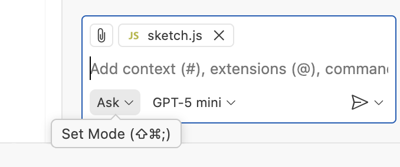

6. **Explain Code**
   - Select the `sketch.js` file and make sure it is the open tab
   - Ask your Copilot Chatbot to explain your code to you: `Explain how this code works using easy to understand concepts`.

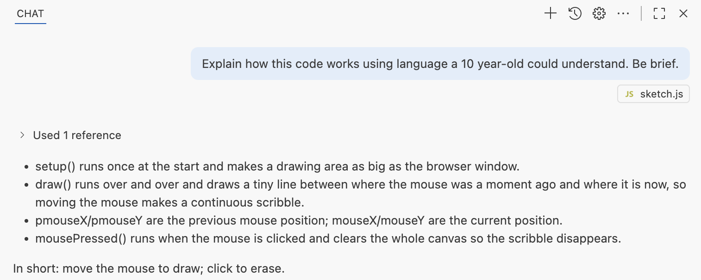

7. **Code Completion**
Code completion is the fundamental method by which you will code during this workshop. With code completion, the robot will make code suggestions (semi-transparent, ghost text) that you will either **ignore**, **reject** (`ESC` key), or **validate** (`TAB`key). The art of how these three actions work (ingore, reject, validate) will seem odd and sometimes even chaotic at first, but will quickly develop into second-nature muscle-memory. Learn to master these keystrokes.

   - Open `sketch.js` and type a comment on a blank line like:  
     ```js
     // clear the canvas when the mouse is pressed
     ```  
   - Copilot should suggest code (ghost text). Press **Tab** to accept Copilot's proposal.

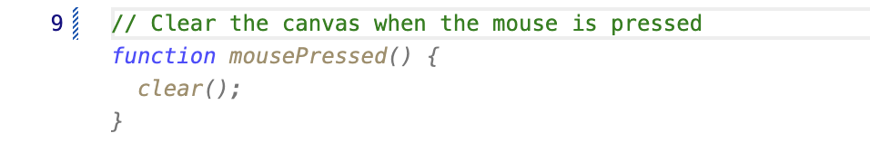

If you see suggestions and the Copilot icon is active, you’re good to go.