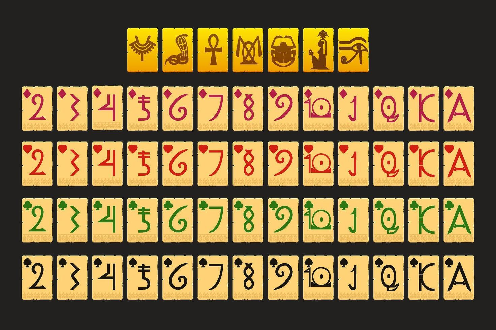
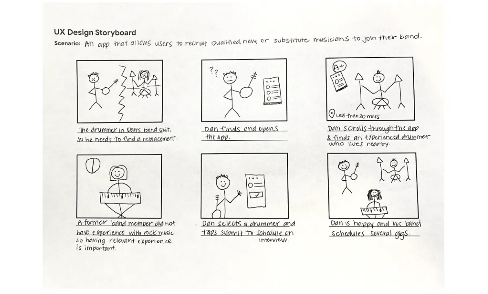

# Firstname LASTNAME

## Research
One sentence that synthesizes what you are researching, followed by up to five insights: these insights need to be matched to images, quotes, screenshots, videos, recordings, et cætera from your field research.

- A first core insight or interest can be described here in a simple phrase
- Another idea
- A third idea can be place here with an accompagnying image:

- Another idea
- [This is a link to a miro board](https://miro.com/app/board/uXjVJFuAjSQ=/)

## Put Your Working Title Here
A short pitch of no more than 500 characters. Describe the core concept. What are you interested in, and why should I care? Do not describe the installation, just the core experience. This text is 212 characters.

## Keyword
Word

## User Journey

## Novel Combinations
- Thing
- Thing
- Thing
